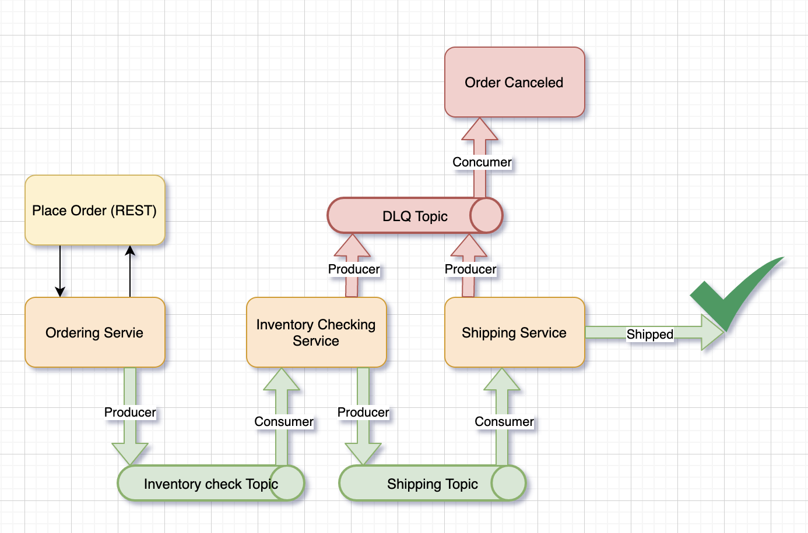

# SCS-100

A basic Example of an Event Driven Flow by the help of **SPRING CLOUD STREAM KAFKA**

* Java Version: `11`
* spring-cloud.version: `Hoxton.SR11` (To get Advantage of Binders `@Input`,`@Output`)
* spring-boot.version: `2.4.5`



The Docker-compose file contains: single kafka and zookeeper. just simply run the following command  
```shell
docker-compose up -d
```

##### Note: I assume you already have docker setup in your machine.
