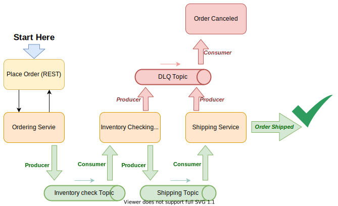

# SCS-100

## PubSub Mechanism

A simple Example of an Event Driven Flow by the help of **SPRING CLOUD STREAM KAFKA**

##### properties

* java.version: `11`
* spring-cloud.version: `Hoxton.SR11` (To get Advantage of Binders `@Input`,`@Output`)
* spring-boot.version: `2.4.5`

### Documentation
Please visit [Spring Cloud Stream Kafka (Part 2)](https://tanzu.vmware.com/developer/guides/event-streaming/spring-cloud-stream-kafka-p2/) for Project documentation




The Docker-compose file contains: single kafka and zookeeper. just simply run the following command

```shell
docker-compose up -d
```

_Note: I assume you already have docker setup in your machine._

### Make the project

run the following command line to create you jar file in `target` directory

```shell
mvn clean package
```

Then run the generated jar file in `target` folder, (so make sure you are in the same directory when you run the jar file
or give the full path)

```shell
java -jar scs-100-0.0.1-SNAPSHOT.jar
```

the application starts to listen on port 8080. make sure that port not being occupied by any other app already, if is try
to pass the following parameter before `-jar` by adding `-Dserver.port=8081` as:

```shell
java -Dserver.port=8081 -jar scs-100-0.0.1-SNAPSHOT.jar
```

_Note: you can also modify the application.yml and set the same properties based on your app profile_

At this point you should have already seen the information about your topics.

### Check Application

#### Create Order or Place your Order
you should now be able to place your order by calling the following `curl` command

```shell
# assuming your app is listening on 8080
ORDER_UUID=$(curl --silent -H 'Content-Type: application/json' -d "{\"itemName\":\"book\"}" http://localhost:8080/order | jq -r '.orderUuid') && for i in `seq 1 15`; do echo $(curl --silent "http://localhost:8080/order/status/"$ORDER_UUID); sleep 1; done;
```
Note: make sure you have already installed the `jq` 

Please visit [Spring Cloud Stream Kafka (Part 2)](https://tanzu.vmware.com/developer/guides/event-streaming/spring-cloud-stream-kafka-p2/) for Project documentation 
